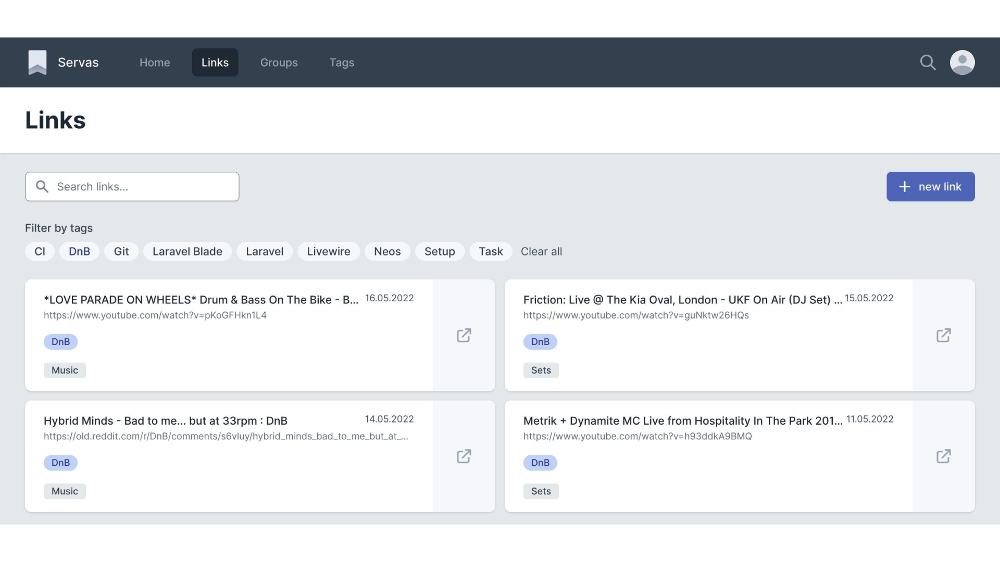
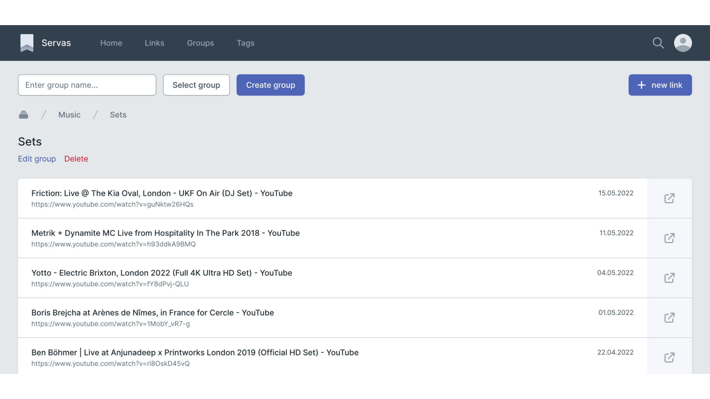
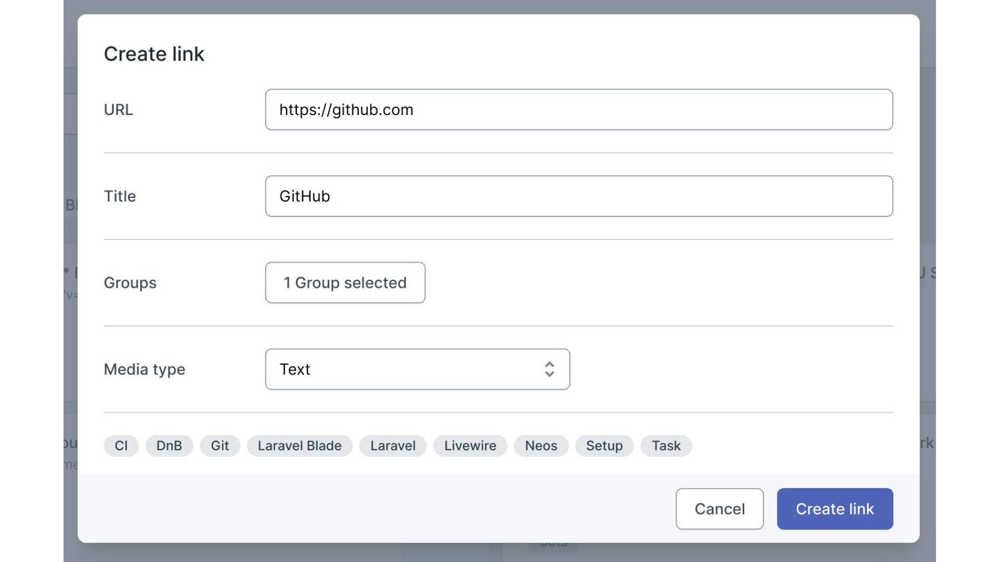
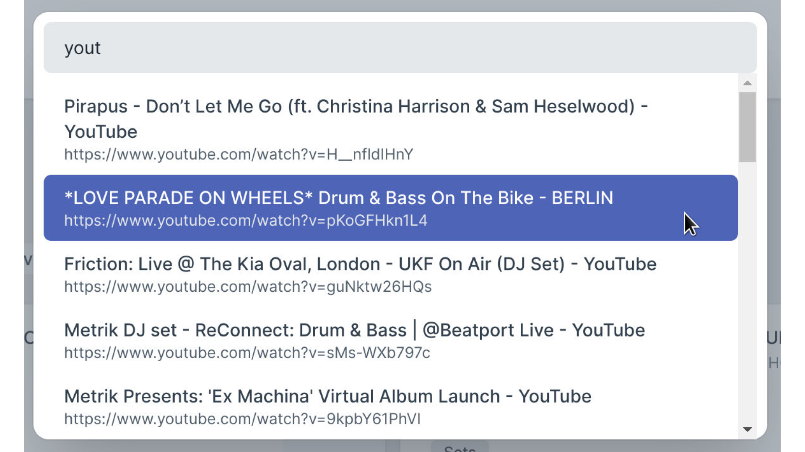

# Servas

A self-hosted bookmark management tool.  
Servas is based on Laravel and Inertia.js and uses Tailwind CSS and Svelte for the frontend.


## Features

- **Tags:** Organize your bookmarks with tags.
- **Groups:** Group your bookmarks. Groups can be nested.
- **Later list:** Add bookmarks to the "later list" to access them later.
- **Chrome browser extension:** Add sites to Servas right from your browser.
- **Multiple users:** You can create multiple user accounts.
- **Responsive design:** Servas looks good on all your devices.
- **Two Factor Authentication available.**

## How to install

### Docker

Servas is available as an [official Docker image](https://hub.docker.com/r/beromir/servas).  
Docker is also the preferred way to use Servas.  
[Docker Compose file](./docker/docker-compose.prod.yaml)

**Initial steps:**

1. Start the containers.
2. Create `.env` file in the directory where the `docker-compose.yaml` is located.
3. Copy the content of the [example env file](./docker/.env.prod.example) into the `.env` file.
4. Change the `APP_URL`.
5. Use a strong password for the `DB_PASSWORD` setting.
6. Run the database migrations.

```shell
docker exec -it servas php artisan migrate
```

7. Generate the application key.

```shell
docker exec -it servas php artisan key:generate
```

### Manual

**Requirements:**

- PHP 8.1
- MySQL
- Git
- Node.js
- Composer

1. Clone the repo.
2. Install the Composer packages.

```shell
composer install
```

3. Install the npm packages.

```shell
npm install
```

4. Compile the assets.

```shell
npm run prod
```

5. Create `.env` file from the `.env.example` file.
6. Change the settings in the `.env` file according to your needs.
7. Run the database migrations.

```shell
php artisan migrate
```

8. Generate the application key.

```shell
php artisan key:generate
```

## User Guide

Register a new user at https://your-servas-instance/register.

## Screenshots

Links view:


Groups view:


New link modal:


Command palette:

